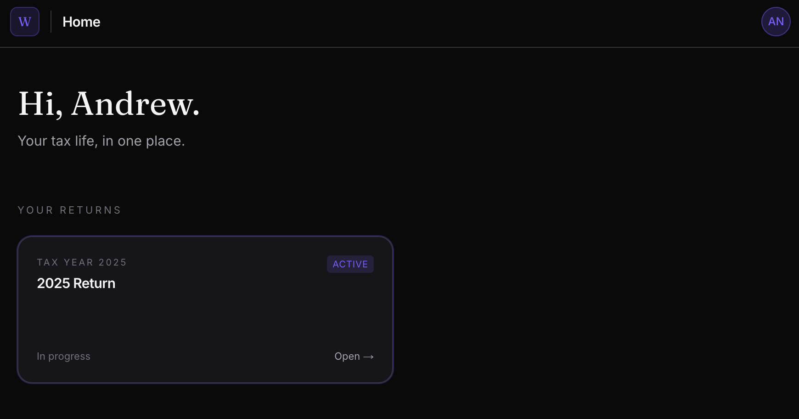
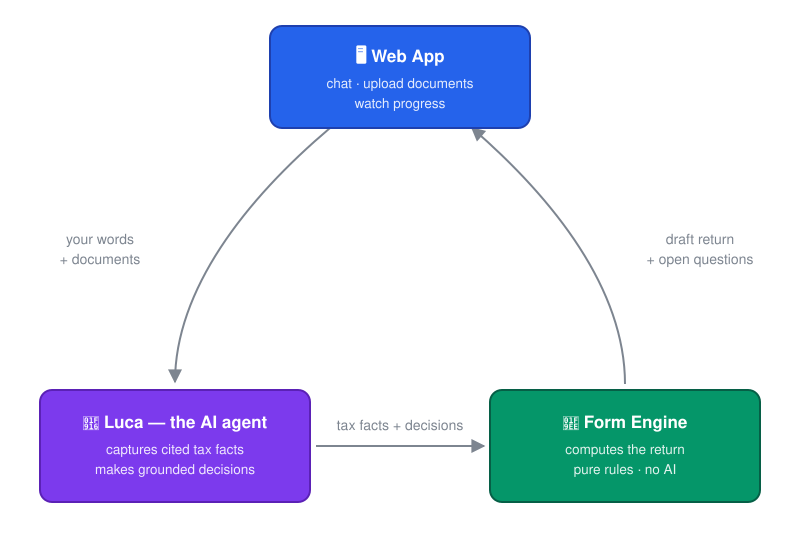

# Summa — AI Can Do Your Taxes

Taxes shouldn't be as hard as they are today. An entire industry profits from keeping the U.S. tax system difficult and opaque — but it doesn't have to be that way.

Summa exists to democratize access to high-quality tax preparation, so you can take back control of one of the biggest moments in your financial life. It's free, open source, and self-hosted: your data, your machine, your return.



## Table of Contents

- [Before you use this — read honestly](#before-you-use-this--read-honestly)
- [How It Works](#how-it-works)
- [Scenario coverage](#scenario-coverage)
- [Quick Start](#quick-start)
- [Contributing](#contributing)
- [License](#license)

## Before you use this — read honestly

- **Your tax data goes to your model provider.** Every conversation turn, and every background grounding check, is an API call carrying your tax facts to the model provider you configured (Anthropic today). Nothing else leaves your machine, but that does.
- **This is not tax advice.** Summa is in a beta state and at the moment
  produces *drafts*. Please double check the work with a CPA.
- **Coverage is narrow** — see the table below. Outside the supported
  scenario, Luca says "we don't handle that yet" rather than guessing.

## How It Works

Summa is built with three distinct parts working together: a web app you talk to, an AI agent that turns the
conversation into data, and a deterministic engine that turns the data into your return.

<p align="center">
  
</p>

- **Web App** — where you live: type messages, store documents, watch your
  return take shape. This is your standard web application
- **Luca (the agent)** — interviews you, and reads the documents you upload
  (a W-2 PDF, a 1099, a photo of either) directly. From both it does two
  critical jobs. It records **tax facts**: verbatim pieces of data, each with
  a citation for where it came from (a document, a statement line, or "you
  told me, on this date").
  And it makes **decisions**: judgment calls where the facts are ambiguous —
  each one double-checked in the background against the actual IRS/FTB
  instruction text, which either cites the supporting passage or reopens the
  question. Numbers are never invented — an unknown becomes an open question,
  not a guess.
- **Form Engine** — a solver. Takes the facts and decisions and computes the
  draft 1040/540 by the tax rules — deterministic code, no AI anywhere in the
  math. Every new fact re-computes the return, so your draft updates live as
  you talk, and the open questions it surfaces are what Luca asks you next.

## Scenario coverage

<!-- TODO(andrew): verify cells against current engine state before publishing -->

State coverage is California-only today.

| Scenario | Federal | State (CA) |
| --- | --- | --- |
| Single filer, W-2 income | ✅ Supported | ✅ Supported |
| Interest + dividend income (1099-INT / 1099-DIV) | ✅ Supported | ✅ Supported |
| Standard deduction | ✅ Supported | ✅ Supported |
| Capital gains (Schedule D / 8949) | 🚧 Partial | ❌ Not yet |
| Itemized deductions (Schedule A) | ❌ Not yet | ❌ Not yet |
| Dependents, MFJ/MFS/HoH | ❌ Not yet | ❌ Not yet |
| Self-employment, K-1s, rental | ❌ Not yet | ❌ Not yet |

## Quick Start

The default setup uses Anthropic models (you need an API key), but Summa
can run against **any OpenAI-compatible model server** — Ollama, LM Studio,
vLLM, llama.cpp, or a self-hosted Hugging Face endpoint — including fully
local models on your own machine. Optionally, a Voyage AI key upgrades
corpus search from keyword to semantic retrieval.

| Variable | Required | What it does |
| --- | --- | --- |
| `LUCA_MODEL` | **Yes** | The conversation agent — must handle images (reads your W-2s). Default `anthropic/claude-sonnet-4-6`. |
| `JUDGE_MODEL` | **Yes** | The grounding judges that double-check AI decisions. Default `anthropic/claude-haiku-4-5`. |
| `ANTHROPIC_API_KEY` | With Anthropic models | Powers the two roles above when they point at Anthropic. |
| `LUCA_MODEL_URL` / `JUDGE_MODEL_URL` | For local models | Point a role at an OpenAI-compatible server instead, e.g. `LUCA_MODEL=ollama/gemma4:26b` + `LUCA_MODEL_URL=http://localhost:11434/v1`. |
| `VOYAGE_API_KEY` | No | Semantic retrieval + reranking over the IRS corpus. Without it, retrieval degrades gracefully to keyword (FTS) search. |
| `AGENT_API_TOKEN` | No | Gates the agent port if it's ever reachable beyond localhost. |

Local-model notes: vision, tool calling, and structured output all matter —
we've verified the full flow (document reading included) on `gemma4` via
Ollama. PDFs are rasterized to images automatically for models without
native PDF input. Expect turns to take minutes, not seconds, on laptop
hardware, and each model call must currently finish within 5 minutes.

Everything else (ports, `.data` paths) is generated with working defaults by
the first-run bootstrap.

```bash
npm run install:all
npm run dev:all          # first run generates .env.development files
# → set ANTHROPIC_API_KEY in apps/agent/.env.development, restart
npm run corpus:fetch     # prebuilt IRS reference corpus
```

Open http://localhost:3000 — first run redirects to `/setup` to create your
owner account.

## Contributing

<!-- TODO(andrew): CLA vs DCO decision goes here before first external PR -->

See [`CONTRIBUTING.md`](CONTRIBUTING.md). For a development guide (repo
layout, commands, design principles), see [`ARCHITECTURE.md`](ARCHITECTURE.md).
Tests: `npm test` (golden-PDF scenario suite) and
`npm --prefix apps/agent run test:unit`.

## TODO - Explain The Agent Architecture

## TODO - Explain the web app architecture

## TODO - Explain the engine architecture


## License

AGPL-3.0 — see [`LICENSE`](LICENSE).
