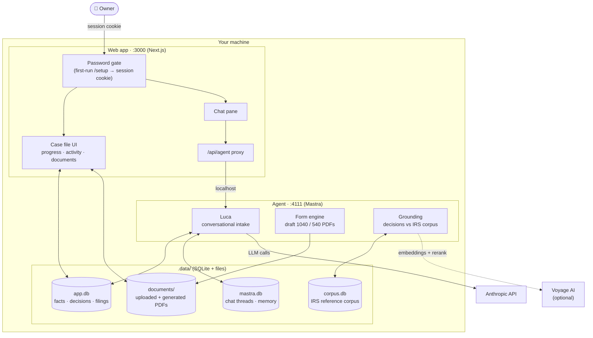

# Summa — AI Can Do Your Taxes

Taxes shouldn't be as hard as they are today. An entire industry profits from keeping the U.S. tax system difficult and opaque — but it doesn't have to be that way.

Summa exists to democratize access to high-quality tax preparation, so you can take back control of one of the biggest moments in your financial life. It's free, open source, and self-hosted: your data, your machine, your return.


## Table of Contents

- [Before you use this — read honestly](#before-you-use-this--read-honestly)
- [How It Works](#how-it-works)
- [Scenario coverage](#scenario-coverage)
- [Quick Start](#quick-start)
- [Contributing](#contributing)
- [Architecture](#architecture)
- [License](#license)

## Before you use this — read honestly

- **Your tax data goes to your model provider.** Every conversation turn, and every background grounding check, is an API call carrying your tax facts to the model provider you configured (Anthropic today). Nothing else leaves your machine, but that does.
- **This is not tax advice.** Summa is in a beta state and at the moment
  produces *drafts*. Please double check the work with a CPA.
- **Coverage is narrow** — see the table below. Outside the supported
  scenario, Luca says "we don't handle that yet" rather than guessing.

## How It Works

Summa is built with three distinct parts working together: a web app you talk to, an AI agent that turns the
conversation into data, and a deterministic engine that turns the data into your return.

<p align="center">
  
</p>

- **Web App** — where you live: type messages, store documents, watch your
  return take shape. This is your standard web application
- **Luca (the agent)** — interviews you, and reads the documents you upload
  (a W-2 PDF, a 1099, a photo of either) directly. From both it does two
  critical jobs. It records **tax facts**: verbatim pieces of data, each with
  a citation for where it came from (a document, a statement line, or "you
  told me, on this date").
  And it makes **decisions**: judgment calls where the facts are ambiguous —
  each one double-checked in the background against the actual IRS/FTB
  instruction text, which either cites the supporting passage or reopens the
  question. Numbers are never invented — an unknown becomes an open question,
  not a guess.
- **Form Engine** — a solver. Takes the facts and decisions and computes the
  draft 1040/540 by the tax rules — deterministic code, no AI anywhere in the
  math. Every new fact re-computes the return, so your draft updates live as
  you talk, and the open questions it surfaces are what Luca asks you next.

## Scenario coverage

<!-- TODO(andrew): verify cells against current engine state before publishing -->

State coverage is California-only today.

| Scenario | Federal (1040) | State (CA 540) |
| --- | --- | --- |
| Single filer, W-2 income | ✅ Supported | ✅ Supported |
| Interest + dividend income (1099-INT / 1099-DIV) | ✅ Supported | ✅ Supported |
| Standard deduction | ✅ Supported | ✅ Supported |
| Capital gains (Schedule D / 8949) | 🚧 Partial | ❌ Not yet |
| Itemized deductions (Schedule A) | ❌ Not yet | ❌ Not yet |
| Dependents, MFJ/MFS/HoH | ❌ Not yet | ❌ Not yet |
| Self-employment, K-1s, rental | ❌ Not yet | ❌ Not yet |

## Quick Start

You need an Anthropic API key. Optionally, a Voyage AI key upgrades corpus
search from keyword to semantic retrieval.

| Variable | Required | What it does |
| --- | --- | --- |
| `ANTHROPIC_API_KEY` | **Yes** | Powers Luca and the grounding judges. |
| `VOYAGE_API_KEY` | No | Semantic retrieval + reranking over the IRS corpus. Without it, retrieval degrades gracefully to keyword (FTS) search. |
| `AGENT_API_TOKEN` | No | Gates the agent port if it's ever reachable beyond localhost. |

Everything else (ports, `.data` paths) is generated with working defaults by
the first-run bootstrap.

```bash
npm run install:all
npm run dev:all          # first run generates .env.development files
# → set ANTHROPIC_API_KEY in apps/agent/.env.development, restart
npm run corpus:fetch     # prebuilt IRS reference corpus
```

Open http://localhost:3000 — first run redirects to `/setup` to create your
owner account.

## Contributing

<!-- TODO(andrew): CLA vs DCO decision goes here before first external PR -->

See [`CONTRIBUTING.md`](CONTRIBUTING.md). For a development guide (repo
layout, commands, design principles), see [`ARCHITECTURE.md`](ARCHITECTURE.md).
Tests: `npm test` (golden-PDF scenario suite) and
`npm --prefix apps/agent run test:unit`.

## Architecture

<!-- TODO: rebuild — this diagram is too complicated for the README -->

Two processes, one contract: the database. The browser only ever talks to
the web app; the agent sits on localhost behind a server-side proxy.



- **Web app** — password-gated case file over the shared DB, plus the chat
  pane. All agent traffic rides the session cookie through the same-origin
  proxy; the browser never holds an agent credential.
- **Agent** — the application: runs the intake conversation, evaluates the
  reactive form engine after every fact, grounds AI judgment calls against
  ingested IRS instructions, renders PDFs.
- **`.data/`** — everything persistent. Copy the directory, you've backed up
  the instance. Delete it (`npm run reset` preserves the corpus), you've
  factory-reset it.

## License

AGPL-3.0 — see [`LICENSE`](LICENSE).
